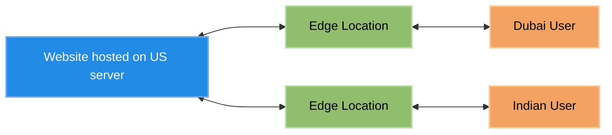

# Network Diagram: US Server and Edge Locations

```mermaid
graph LR
    US[Website hosted on US server]

    US <---> Edge1[Edge Location]
    US <---> Edge2[Edge Location]

    Edge1 <---> DubaiUser[Dubai User]
    Edge2 <---> IndianUser[Indian User]

    style US fill:#228be6,stroke:#6ea8ea,stroke-width:2px,color:#fff
    style Edge1 fill:#90be6d,stroke:#b3d9a5,stroke-width:2px,color:#000
    style Edge2 fill:#90be6d,stroke:#b3d9a5,stroke-width:2px,color:#000
    style DubaiUser fill:#f4a261,stroke:#f9c995,stroke-width:2px,color:#000
    style IndianUser fill:#f4a261,stroke:#f9c995,stroke-width:2px,color:#000
```
